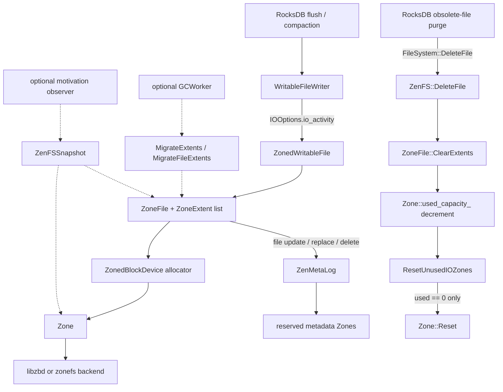

# FragSense M0 Code Audit

## 1. Scope, inputs, and verdict

This document is the Milestone M0 (里程碑 M0) audit only. No production code,
on-disk format, Zone reset behavior, or FragSense control logic was changed as
part of M0.

Audit inputs:

- Repository commit: `750a3cbd1cd555d0a84d3f30a91d854f2d74b82a`
- Baseline branch/commit: `main` at
  `d7d37643a610d19d58c714763737177ea6b75be3`
- M0 branch: `codex/fragsense-m0-audit`
- Instructions used: the bundle-local
  `docs/fragsense/fragsense_codex_56_sol_bundle/AGENTS.md`,
  `IMPLEMENTATION_PLAN.md`, and `CODEX_RUNBOOK.md`

Repository-layout discrepancy: there is no tracked root `AGENTS.md`, and the
authoritative plan/runbook are currently in an untracked bundle subdirectory,
not at the paths named by the runbook. This must be fixed before M1 so future
tasks cannot silently use a different contract.

M0 verdict:

- Native ZenFS uses Lazy Reset (惰性重置): deletion removes logical live bytes,
  and only a Zone with zero live bytes is reset.
- This tree also contains an optional active GC (主动垃圾回收) and extent
  migration (extent 搬移) path controlled by a superblock flag created through
  `zenfs mkfs --enable_gc`; the default is `false`.
- The motivation observer is committed and disabled by default, but it adds a
  branch/function call to write and extent lifecycle paths even while disabled.
  Native semantics are unchanged; the disabled performance path is not
  instruction-for-instruction identical.
- The current migration implementation is not a safe M3 foundation. It publishes
  the in-memory extent list before metadata persistence, has an unprotected file
  lookup, and ignores important copy/persistence errors.
- `kFileReplace` can represent one authoritative full mapping during replay, but
  the current backend has no explicit metadata flush/barrier API. Power-loss
  durability must be established before any source Zone reset is accepted.
- A fresh Linux build/test was not possible from this Windows checkout: the
  copied CMake cache points to `/home/femu/rocksdb`, WSL is not installed, and
  hostname `fvm` is not resolvable. Therefore M0's clean-build acceptance item
  remains open; no old build output is treated as fresh evidence.

## 2. Version and provenance freeze

### 2.1 RocksDB

`include/rocksdb/version.h` declares:

```text
ROCKSDB_MAJOR 8
ROCKSDB_MINOR 11
ROCKSDB_PATCH 3
```

Exact RocksDB source identity for this audit is repository commit `750a3cb`,
with the Native baseline at `d7d3764`. The worktree is dirty because it contains
unrelated staged and untracked material; the M0 commit must include only this
file.

### 2.2 ZenFS

ZenFS is vendored under `plugin/zenfs`; it is not a Git submodule and has no
independent upstream commit object in this repository. The ignored generated
file `plugin/zenfs/fs/version.h` currently reports:

```text
ZENFS_VERSION "v2.1.0-65-g919c2eb-dirty"
```

Upstream commit `919c2eb` exists and is titled `fs: fix compile error on latest
RocksDB`. However, the generated file is ignored and may be stale. The local
vendored history starts at repository commit `6cbfb73`; it does not preserve an
independently verifiable ZenFS upstream object. The defensible version statement
is therefore:

> ZenFS code derived from upstream `v2.1.0-65-g919c2eb`, vendored into this
> repository, plus local baseline changes and motivation observer commit
> `750a3cb`; exact source equivalence to upstream `919c2eb` is not proven.

The on-disk superblock format is version `2`
(`Superblock::CURRENT_SUPERBLOCK_VERSION`). The build requires Linux and
`libzbd >= 1.5.0` for the block-device backend.

### 2.3 Motivation observer patch

Commit `750a3cb` modifies six production files relative to `main`:

| File | Change |
| --- | --- |
| `plugin/zenfs/fs/fs_zenfs.cc` | observer lifecycle, CSV/JSON output, snapshot aggregation |
| `plugin/zenfs/fs/fs_zenfs.h` | observer worker state and methods |
| `plugin/zenfs/fs/io_zenfs.cc` | extent-created/invalidated callbacks |
| `plugin/zenfs/fs/snapshot.h` | additional Zone state/counter fields |
| `plugin/zenfs/fs/zbd_zenfs.cc` | enable detection and atomic event counters |
| `plugin/zenfs/fs/zbd_zenfs.h` | `ZoneFragStats` and observer callback API |

Patch size: 543 insertions and 6 deletions. The observer code is committed;
the runners, analyzers, bundle documents, and observer validation scripts in
`scripts/fragsense`, `tools/fragsense`, and `docs/fragsense` are currently
untracked.

## 3. Repository, build, and test topology



Build integration:

- Top-level `CMakeLists.txt` loads plugins through `ROCKSDB_PLUGINS`.
- `plugin/zenfs/CMakeLists.txt` exports ZenFS sources and links `libzbd`.
- `WITH_ZENFS_TOOL=ON` builds `zenfs_tool`; benchmark builds use
  `WITH_BENCHMARK_TOOLS=ON`.
- The copied Linux cache was configured as Release with
  `ROCKSDB_PLUGINS=zenfs`, `WITH_TESTS=ON`, `WITH_ALL_TESTS=OFF`,
  `WITH_GFLAGS=ON`, `WITH_SNAPPY=ON`, and `WITH_ZENFS_TOOL=ON`.
- ZenFS has shell-based utility, smoke, performance, and crash tests under
  `plugin/zenfs/tests`. No focused C++ unit test for Zone accounting,
  metadata replacement, migration, or the motivation observer is present.
- Existing ZenFS shell tests perform `mkfs` and require a real or emulated
  zoned device. They were not run automatically during M0.

## 4. Core data structures and state transitions

### 4.1 `Zone`

Location: `plugin/zenfs/fs/zbd_zenfs.h` and `.cc`.

Important fields:

- `start_`: physical Zone start offset.
- `wp_`: cached write pointer.
- `capacity_`: remaining writable capacity, not total capacity.
- `max_capacity_`: total usable Zone capacity.
- `used_capacity_`: atomic logical live bytes referenced by durable/in-memory
  file extents. It excludes invalid bytes and can exclude physical padding or
  sparse headers.
- `lifetime_`: `Env::WriteLifeTimeHint` used by allocation.
- `busy_`: atomic exclusive lease for allocation, active append, finish, and
  reset operations.
- `frag_stats_`: observer-only event counters added by `750a3cb`.

State transitions:

- Constructor derives `capacity_` from device-reported `wp_`.
- `Append()` performs aligned sequential writes and advances `wp_` while
  reducing `capacity_`.
- `Finish()` sets `capacity_=0` and moves the cached `wp_` to Zone end.
- `Close()` closes a non-empty, non-full Zone but does not change logical
  capacity. Such a Zone can later be selected again by the allocator.
- `Reset()` asserts `used_capacity_==0` and `busy_==true`, resets through the
  backend, restores capacity/write pointer/lifetime, and records an observer
  reset event.

`is_sealed` in the observer currently means only `capacity_==0`. It does not
represent a separately persisted FragSense lifecycle state.

### 4.2 `ZoneExtent`

Location: `plugin/zenfs/fs/io_zenfs.h` and `.cc`.

The runtime object stores `start_`, `length_`, and a non-owning `Zone*`. The
durable representation stores only `start_` and `length_`; recovery reconstructs
the Zone pointer with `ZonedBlockDevice::GetIOZone(start_)`.

Extents are physical, block-aligned contiguous regions and do not cross a Zone.
They are the correct source for block- or interval-level liveness. There is no
key-level liveness in ZenFS.

### 4.3 `ZoneFile`

Location: `plugin/zenfs/fs/io_zenfs.h` and `.cc`.

Important state:

- `extents_`: ordered file-to-physical mapping.
- `linkfiles_`: all hard-link names; `ZenFS::files_` maps each name to a shared
  `ZoneFile`.
- `active_zone_`, `extent_start_`, `extent_filepos_`: in-progress append and
  crash-recovery state.
- `file_id_`, `file_size_`, `lifetime_`, `io_type_`.
- `nr_synced_extents_`: boundary between durable and unsynced extent metadata.
- `open_for_wr_mtx_`: excludes reopening/writing and current GC migration.
- `writer_mtx_` plus `readers_`: protects extent-list publication against
  readers during replacement.

The durable per-file tags are `kFileID`, `kFileSize`, `kWriteLifeTimeHint`,
`kExtent`, `kModificationTime`, `kActiveExtentStart`, `kIsSparse`, and
`kLinkedFilename`.

### 4.4 `ZenFS` and `ZonedBlockDevice`

`ZenFS::files_` is the authoritative in-memory namespace and mapping index.
`files_mtx_` protects it. `ZenMetaLog` is the append-only metadata log. Its
records are block aligned and contain a length and CRC.

`ZonedBlockDevice` owns metadata and I/O Zone vectors, open/active Zone tokens,
allocation policy, reset scanning, deferred error state, and migration
destination serialization.

## 5. Exact write, deletion, invalidation, and reset flows

### 5.1 Allocation and append

1. `ZenFS::OpenWritableFile()` creates a `ZoneFile`, persists its initial
   metadata, and holds `open_for_wr_mtx_` for the writable file lifetime.
2. WAL files are recognized by `.log`; all other files use `IOType::kUnknown`.
3. `ZoneFile::AllocateNewZone()` calls
   `ZonedBlockDevice::AllocateIOZone(lifetime_, io_type_)` and persists
   `kActiveExtentStart` before data append for crash recovery.
4. `ZonedWritableFile::Append()` receives `IOOptions`, but ZenFS currently
   discards `IOOptions::io_activity`.
5. Direct, buffered, and sparse paths call `Zone::Append()` and create
   `ZoneExtent` objects. Extent creation increments `used_capacity_` by logical
   extent length.
6. `Sync`/`Fsync`/`Close` eventually persist new extent metadata. Direct append
   data is materialized as an extent by `ZoneFile::PushExtent()`.

### 5.2 Compaction input deletion to Lazy Reset

Compaction records obsolete SSTs in a `VersionEdit`. Later
`DBImpl::FindObsoleteFiles()` / `DBImpl::PurgeObsoleteFiles()` calls
`DeleteDBFile()` or the `DeleteScheduler`, which ultimately invokes
`FileSystem::DeleteFile()` without a compaction-origin tag.

The exact ZenFS sequence is:

1. `ZenFS::DeleteFile()` locks `files_mtx_`.
2. `ZenFS::DeleteFileNoLock()` removes the name from `files_` and from
   `ZoneFile::linkfiles_`.
3. It appends a durable `kFileDeletion` record containing file ID and link name.
4. On persistence failure it restores the namespace entry and link.
5. If another hard link remains, extents remain live.
6. If the last link is gone, the file is marked deleted and the final
   `shared_ptr` is released.
7. `ZoneFile::~ZoneFile()` calls `ClearExtents()`.
8. `ClearExtents()` decrements each extent's `zone_->used_capacity_`, records an
   observer invalidation event, and deletes the extent object.
9. After releasing `files_mtx_`, `ZenFS::DeleteFile()` calls
   `ZonedBlockDevice::ResetUnusedIOZones()`.
10. That scan acquires each Zone's `busy_` lease and resets only a Zone that is
    non-empty and has `used_capacity_==0`.
11. `Zone::Reset()` asserts zero live capacity before issuing the backend reset.

This is Lazy Reset. A Zone with invalid space and one remaining live byte is not
reset by this path.

### 5.3 Recovery rebuild

Metadata record tags are:

- `kCompleteFilesSnapshot`
- `kFileUpdate`
- `kFileDeletion`
- `kEndRecord`
- `kFileReplace`

Mount/recovery sequence:

1. `ZenFS::Mount()` scans reserved metadata Zones for valid superblocks.
2. It orders candidates by descending superblock sequence and replays the newest
   log with a valid complete snapshot.
3. `DecodeSnapshotFrom()` and `DecodeFileUpdateFrom()` rebuild `ZoneFile`
   objects and extents. `ZoneFile::DecodeFrom()` resolves each extent's Zone and
   increments `used_capacity_`.
4. `kFileDeletion` replay removes the named link. Last-reference destruction
   clears extents and decrements capacity.
5. `kFileReplace` calls `MergeUpdate(..., replace=true)`, which clears the old
   extent list and installs the complete replacement mapping.
6. `Repair()` reconstructs a crashed active extent from persisted
   `kActiveExtentStart` to the device-reported Zone write pointer.
7. A writable mount rolls to a new metadata Zone, writes a fresh full snapshot,
   and then calls `ResetUnusedIOZones()`.

Thus a future migrated mapping can be recovered through a full `kFileReplace`
record. The current runtime publication and durability ordering are the unsafe
parts, not the basic ability of replay to express a replacement.

## 6. Existing active GC and migration path

GC is not enabled by default. `zenfs mkfs --enable_gc` persists
`FLAGS_ENABLE_GC`; a writable mount starts `ZenFS::GCWorker()` only when that
flag is set.

Every 10 seconds, the worker checks free-space percentage, snapshots full Zones,
selects Zones by approximate garbage percentage, and calls
`MigrateExtents()` / `MigrateFileExtents()` for SST extents. It then invokes
Native `ResetUnusedIOZones()`.

This path must not be used as the M3 implementation without correction:

- `MigrateFileExtents()` calls `GetFileNoLock()` without holding `files_mtx_`.
- `ZoneFile::MigrateData()` ignores `target_zone->Append()` status and does not
  reject a short read.
- Callers ignore `MigrateData()` status.
- `SyncFileExtents()` publishes `new_extent_list` before persisting
  `kFileReplace`.
- Persistence failure leaves the new in-memory mapping published and old
  accounting uncleared.
- `MigrateFileExtents()` ignores the return value from `SyncFileExtents()` and
  returns `OK`.
- File deletion uses `files_mtx_`, not `ZoneFile::WriteLock`; the current
  migration exclusion is not a complete delete/migrate protocol.
- The raw backend uses `O_DIRECT` writes, but metadata append exposes no explicit
  flush/FUA/barrier operation that proves power-loss durability before reset.

Native experiments must continue to format without `--enable_gc`.

## 7. Locking and concurrency map

| Lock/resource | Protects | Required order/notes |
| --- | --- | --- |
| `ZenFS::files_mtx_` | namespace, link set operations, file lookup and metadata mapping mutations | Acquired before `metadata_sync_mtx_` on normal metadata writes |
| `ZenFS::metadata_sync_mtx_` | serialized metadata-log append/roll | `RollMetaZoneLocked()` assumes `files_mtx_` is already held |
| `ZoneFile::open_for_wr_mtx_` | one writer/reopen or current GC migration | Does not by itself exclude deletion |
| `ZoneFile::writer_mtx_` + `readers_` | extent-list replacement vs reads | `WriteLock` spins while readers drain; no condition variable |
| `ZonedWritableFile::buffer_mtx_` | buffered append state | Local to one writable wrapper |
| `Zone::busy_` | exclusive Zone allocation/append/finish/reset lease | Atomic acquire/release, not a general state mutex |
| `zone_resources_mtx_` + CV | open/active Zone token waits | Counts are atomic; CV coordinates availability |
| `zone_deferred_status_mutex_` | deferred allocator error | Independent of file metadata locks |
| `migrate_zone_mtx_` + CV | one migration destination lease | Serializes current migration allocation, not all source-file races |
| `fragsense_stats_dump_mtx_` | observer output file append | Does not protect Zone fields or extent mappings |

Existing observer snapshots read plain `Zone::wp_`, `capacity_`, and `lifetime_`
without taking `busy_`. That is a potential C++ data race during concurrent
append/allocation. `used_capacity_` and observer counters are atomic, but a CSV
row is not a coherent atomic snapshot of all fields.

## 8. Background tasks, metrics, and rate control

ZenFS-owned background threads:

- `ZenFS::GCWorker`: optional, persisted `--enable_gc`, 10-second loop.
- `ZenFS::FragSenseStatsWorker`: optional observer, enabled only by observer
  environment variables.
- `ZenFSPrometheusMetrics::run`: optional build-time exporter, 5-second report
  interval on `127.0.0.1:8080`.

Other relevant RocksDB facilities:

- RocksDB `Env` background pools and `Schedule()` API.
- `DBOptions::rate_limiter` and `WritableFileWriter` token charging by
  `Env::IOPriority`.
- `DeleteScheduler` can delete files in its own background thread.

ZenFS has no `DB*` reference, so it cannot directly query DB properties. A
future compaction-pressure provider needs a small cross-layer interface or an
application-owned `EventListener`; log parsing is not acceptable for runtime
control.

## 9. Configuration audit

Current ZenFS configuration surfaces:

- Factory URI: `zenfs://dev:<name>`, `zenfs://uuid:<uuid>`, or
  `zenfs://zonefs:<mountpoint>`.
- `zenfs mkfs` flags include `--aux_path`, `--finish_threshold`, and
  `--enable_gc=false`.
- `finish_threshold` and GC enablement are persisted in the superblock.
- Motivation observer environment variables:
  `ZENFS_FRAGSENSE_OBSERVE`, `ZENFS_FRAGSENSE_OBSERVE_DIR`,
  `ZENFS_FRAGSENSE_OBSERVE_INTERVAL_MS`,
  `ZENFS_FRAGSENSE_BLOCKED_INVALID_RATIO`, plus the legacy stats path/interval.

There is no existing runtime `Configurable` object for ZenFS policy options and
no URI key/value parser beyond backend selection. M1 must introduce one validated
`FragSenseConfig` boundary with `fragsense_enabled=false`; scattered `getenv()`
calls in foreground code would be an unacceptable configuration design.

## 10. RocksDB origin and compaction-pressure signals

### 10.1 Best available write-origin signal

RocksDB 8.11.3 exposes `Env::IOActivity::{kFlush,kCompaction,...}` in
`IOOptions`. Flush and compaction table builders create `WriteOptions` with the
corresponding activity, and `WritableFileWriter::PrepareIOOptions()` propagates
it to filesystem append calls.

ZenFS receives this at `ZonedWritableFile::Append()` and
`PositionedAppend()`, but both signatures intentionally ignore the `options`
parameter today. This is the least invasive reliable M1 hook for separating
foreground-update flush output from compaction output.

`TableFileCreationReason` and `EventListener::OnTableFileCreationStarted()` /
`OnTableFileCreated()` also distinguish flush and compaction at file granularity,
but that information is not automatically attached to `ZoneFile`.
`WriteLifeTimeHint==MEDIUM` is only an allocator heuristic for L0 flushes and is
not a sufficient origin classifier.

Deletion does not carry `IOActivity`; obsolete-file purge reaches
`FileSystem::DeleteFile()` with default/unknown `IOOptions`. M1 should update
liveness on every deletion, but must not infer foreground versus compaction
origin from that deletion call.

### 10.2 Pressure and stall signals

Available `DB::Properties` include:

- `kEstimatePendingCompactionBytes` (level compaction only)
- `kNumRunningCompactions`
- `kNumRunningFlushes`
- `kCompactionPending`
- `kNumFilesAtLevelPrefix` (especially L0)
- `kNumImmutableMemTable` and `kMemTableFlushPending`
- `kActualDelayedWriteRate`
- `kIsWriteStopped`
- `kCFWriteStallStats` and `kDBWriteStallStats`
- `kBackgroundErrors`

Available callbacks/counters include
`EventListener::OnCompactionBegin/Completed`,
`OnFlushBegin/Completed`, `OnStallConditionsChanged`, `OnBackgroundError`,
the `STALL_MICROS` ticker, and `WRITE_STALL` histogram.

Recommendation for M5, not M1: use a DB-side provider that samples pending
bytes, running jobs, L0 count, delayed/stopped state, and stall callbacks. Do not
make ZenFS parse LOG text.

## 11. Motivation observer limitations

The observer is read-only in intent and starts only when explicitly configured.
Its current output is useful for motivation experiments, but it must not be
promoted directly to M1 production state:

- `segments` are extent-level merged intervals, not block-level segments.
- `frag = segments / live_extent_count`, not the planned
  `segments / valid_blocks`.
- `age_sec` is time since first observed write, not time since logical sealing.
- `is_open` and `is_active` are the same heuristic and do not preserve the
  backend-reported NVMe state.
- `is_sealed` means `capacity_==0`; partial closed Zones are not sealed.
- CSV `file_extent_count` is populated from cumulative `extent_count_total`,
  not current live file extents.
- Recovery rebuild callbacks can make observer event sequence/count semantics
  differ from runtime-only activity.
- Snapshot fields are not read as one coherent synchronized state.
- Disabled mode still executes early-return callback calls in append and extent
  paths.
- No committed focused observer unit test exists.

These are measurement-definition issues, not evidence that the archived
motivation experiment is fabricated. Captions must continue to say
extent-level fragmentation where applicable.

## 12. Proposed safe hooks and exact M1-M3 symbol map

| Milestone | Concern | Proposed hook/symbol | Constraint |
| --- | --- | --- | --- |
| M1 | config/state ownership | new `plugin/zenfs/fragsense/fragsense_config.*` and `fragsense_zone_state.*`, owned by `ZenFS`/`ZonedBlockDevice` | disabled by default; no global mutable state |
| M1 | allocation/liveness add | `ZoneFile::PushExtent`, `BufferedAppend`, `SparseAppend`, `Recover`, `DecodeFrom`, `MergeUpdate` | one interval event per actual live extent; idempotent recovery rebuild |
| M1 | invalidation | `ZoneFile::ClearExtents`, successful replacement cleanup in `ZenFS::SyncFileExtents` | update before/with logical mapping removal, never from physical WP alone |
| M1 | reset | `Zone::Reset` after backend success | clear state and generation only after successful reset |
| M1 | origin/Hot(z) | `ZonedWritableFile::Append` and `PositionedAppend` using `IOOptions::io_activity` | count `kFlush`; exclude `kCompaction`; define recovery/unknown conservatively |
| M1 | seal age | `Zone::Append` on transition to zero capacity and `Zone::Finish`; clear in `Reset` | logical sealed state must be explicit and distinct from close |
| M1 | snapshots | replace observer scans with synchronized/immutable state snapshots | no whole-Zone scan on each foreground append |
| M2 | policy/control | new `fragsense_policy.*`, controller background cycle, structured decision log | dry-run hard gate cannot call migration/reset |
| M3 | source view | `ZenFS::MigrateFileExtents` replacement under `files_mtx_` plus `ZoneFile::WriteLock` protocol | deletion and reads must have explicit ordering |
| M3 | copy | hardened `ZoneFile::MigrateData` or new migrator class | check full read/write, alignment, checksum, and all statuses |
| M3 | durable switch | encode detached full mapping, append/sync `kFileReplace`, then publish | never publish before durable record |
| M3 | reset | existing `ResetUnusedIOZones` / `Zone::Reset` after source-reference proof | no direct bypass of zero-live assertion |

## 13. Proposed copy-before-switch protocol and recovery implications

The minimum credible M3 protocol is:

1. Explicitly enable FragSense active mode and require a manual source Zone ID.
2. Under the defined file/source lock order, take a stable list of all live
   source extents and verify that the file is not deleted or open for write.
3. Reserve destination capacity with a dedicated RAII reservation.
4. Copy each extent; require full reads and successful full aligned appends.
5. Validate lengths and available checksum/integrity information.
6. Build a detached complete replacement mapping. Do not mutate `extents_` yet.
7. Append a complete `kFileReplace` record for that candidate mapping and issue
   a proven metadata durability operation.
8. Publish the new extent vector under `ZoneFile::WriteLock` while the namespace
   identity is still stable.
9. Mark old source extents invalid in accounting.
10. Re-scan/prove that no live mapping references the source Zone.
11. Call the existing `ResetUnusedIOZones()` path; retain the
    `Zone::Reset()` zero-live assertion.

Recovery cases:

- Crash before durable `kFileReplace`: old mapping remains authoritative;
  destination copies are leaked/invalid and may be reclaimed after rebuild.
- Crash after durable record but before in-memory publish: replay selects the new
  mapping; source bytes become invalid after rebuild.
- Crash after publish but before reset: replay selects the new mapping and Lazy
  Reset can reset the now-unreferenced source.
- Reset must never occur before the record is known durable.

The current CRC-framed append log gives record-level validation, and
`kFileReplace` gives last-record mapping authority. It does not by itself prove
power-loss durability. Before M3, either add/verify a backend flush/barrier
operation or document and test a device guarantee strong enough to make step 7
true. Without that proof, M3 must stop before source reset.

## 14. Risks and unresolved questions

### Blocking before M1

1. Move/copy the bundle instructions to their promised tracked paths and define
   one root `AGENTS.md`.
2. Pin ZenFS provenance with an upstream commit plus a patch series or subtree
   metadata. The ignored generated version string is insufficient.
3. Obtain a reproducible Linux build/test environment (FEMU, nullblk, or an
   explicitly approved device) and record a clean baseline result.
4. Decide whether disabled-mode callback overhead from the observer is accepted
   or must be compiled/branched out more tightly.

### Blocking before M3

1. Define and enforce the file/delete/migration lock order.
2. Reverse the current publish-before-persist ordering.
3. Propagate every copy and metadata error; add short-I/O handling.
4. Prove metadata durability before source reset.
5. Add fault injection around copy, record append, publish, accounting, and
   reset.
6. Decide whether one `kFileReplace` record is sufficient after adding a durable
   barrier or whether explicit relocation transaction records are required for
   cleanup and diagnostics.

### Additional correctness/measurement risks

- `used_capacity_` is logical live extent bytes, not physical occupied bytes.
- Observer Zone fields are not a coherent synchronized snapshot.
- Current GC run flag is a plain `bool` shared with its worker thread.
- Current `WriteLock` busy-waits for readers and can waste CPU.
- A partial closed Zone can be reopened; close time is not seal time.
- `GetFileNoLock()` usage in current migration violates its documented locking
  precondition.
- `kEstimatePendingCompactionBytes` is not valid for all compaction styles.
- ZenFS cannot query DB properties without a cross-layer provider.

## 15. Exact clean build and test commands

Run these on a Linux host with `libzbd >= 1.5.0`; they are non-destructive:

```bash
cd /home/femu/rocksdb
rm -rf cmake-build-fragsense-m0
cmake -S . -B cmake-build-fragsense-m0 \
  -DCMAKE_BUILD_TYPE=Release \
  -DROCKSDB_PLUGINS=zenfs \
  -DWITH_GFLAGS=ON \
  -DWITH_SNAPPY=ON \
  -DWITH_TESTS=ON \
  -DWITH_ALL_TESTS=OFF \
  -DWITH_BENCHMARK_TOOLS=ON \
  -DWITH_ZENFS_TOOL=ON
cmake --build cmake-build-fragsense-m0 \
  --target rocksdb-shared zenfs_tool db_bench \
  --parallel "$(nproc)"
ctest --test-dir cmake-build-fragsense-m0 \
  --output-on-failure
```

The narrowest existing ZenFS integration tests still require formatting a zoned
backend. Under the repository rules, do not run them until a human explicitly
approves the target device or provides a disposable FEMU/nullblk target. After
approval, use the repository's `plugin/zenfs/tests/smoke` runner with the exact
device recorded in experiment metadata. Do not add `--enable_gc` for Native
baseline testing.

M0 execution status:

- Source/version/flow/lock/config/signal audit: completed.
- Production code change: none.
- Fresh clean Linux build: not run; no reachable Linux execution environment.
- ZenFS device integration test: not run; it would require destructive `mkfs`.
- Native regression result: not established in this M0 environment.

## 16. Milestone-sized patch plan

### M1: sensing only

1. Add one default-disabled validated config/state owner.
2. Add block-aligned liveness and incremental segment accounting with focused
   fake-backend tests.
3. Propagate `IOOptions::io_activity` to foreground/compaction-separated events.
4. Add logical seal generation/time and recovery rebuild.
5. Replace observer-derived production state with coherent snapshots.
6. Prove Native-disabled behavior and measure callback overhead.

Stop for Gate A review. Do not add selection, migration, or new resets.

### M2: dry-run policy only

1. Add policy interfaces and explicit admission/reject reasons.
2. Run selection from a background control cycle over immutable snapshots.
3. Add a hard compile/runtime boundary preventing migrator/reset calls.
4. Emit replayable decision records and compare policies offline.

Stop for Gate B review.

### M3: manual single-Zone evacuation only

1. First harden the metadata durability and lock protocol identified above.
2. Implement checked copy into an RAII destination reservation.
3. Persist detached replacement mapping before publication.
4. Add source-reference proof and reuse only the existing zero-live reset path.
5. Add fault injection/recovery tests for every ordering boundary.

Stop for Gate C review. Do not add autonomous policy control, elastic budget,
multi-Zone regrouping, or compaction-aware throttling.
